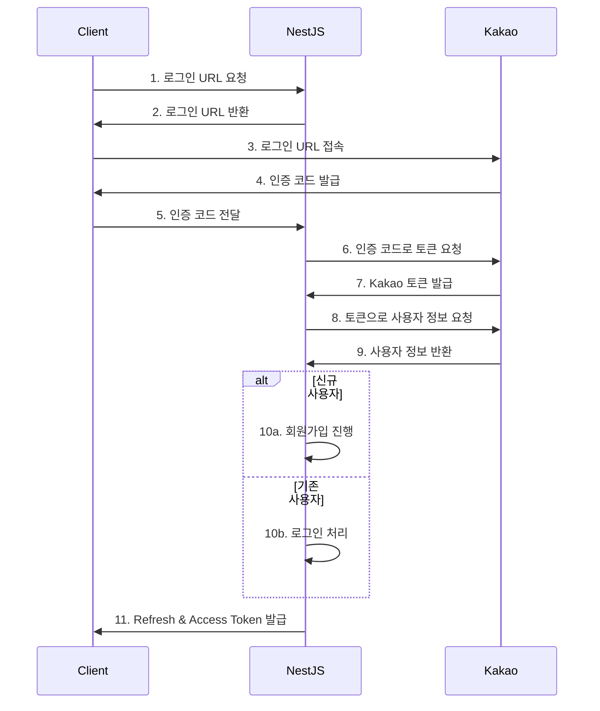

# 인증 및 TODO 서비스 GraphQL API 문서

## 목차

- [인증 및 TODO 서비스 GraphQL API 문서](#인증-및-todo-서비스-graphql-api-문서)
  - [목차](#목차)
- [인증 서비스 GraphQL API 문서](#인증-서비스-graphql-api-문서)
  - [1. Mutation (상태 변경)](#1-mutation-상태-변경)
    - [\[1\] 유저 생성](#1-유저-생성)
    - [\[2\] 유저 삭제](#2-유저-삭제)
    - [\[3\] 유저 정보 업데이트](#3-유저-정보-업데이트)
    - [\[4\] refreshToken을 이용한 accessToken 재발급](#4-refreshtoken을-이용한-accesstoken-재발급)
    - [\[5\] 카카오 인증](#5-카카오-인증)
  - [2. Query (조회)](#2-query-조회)
    - [\[1\] 유저 정보 조회](#1-유저-정보-조회)
    - [\[2\] 카카오 로그인 URL 조회](#2-카카오-로그인-url-조회)
- [TODO 서비스 GraphQL API 문서](#todo-서비스-graphql-api-문서)
  - [서비스 개요](#서비스-개요)
  - [3. Project (대분류)](#3-project-대분류)
    - [\[1\] Mutation](#1-mutation)
      - [1.1 프로젝트 생성](#11-프로젝트-생성)
      - [1.2 프로젝트 삭제](#12-프로젝트-삭제)
      - [1.3 프로젝트 업데이트](#13-프로젝트-업데이트)
    - [\[2\] Query](#2-query)
      - [2.1 단일 프로젝트 조회](#21-단일-프로젝트-조회)
      - [2.2 모든 프로젝트 조회](#22-모든-프로젝트-조회)
  - [4. Category (중분류)](#4-category-중분류)
    - [\[1\] Mutation](#1-mutation-1)
      - [4.1 카테고리 생성](#41-카테고리-생성)
      - [4.2 카테고리 삭제](#42-카테고리-삭제)
      - [4.3 카테고리 업데이트](#43-카테고리-업데이트)
    - [\[2\] Query](#2-query-1)
      - [4.4 카테고리 조회](#44-카테고리-조회)
  - [5. Task (소분류)](#5-task-소분류)
    - [\[1\] Mutation](#1-mutation-2)
      - [1.1 Task 생성](#11-task-생성)
      - [1.2 Task 삭제](#12-task-삭제)
      - [1.3 Task 업데이트](#13-task-업데이트)
    - [\[2\] Query](#2-query-2)
      - [2.1 Task 조회](#21-task-조회)
      - [2.2 카테고리별 Task 목록 조회](#22-카테고리별-task-목록-조회)

---

# 인증 서비스 GraphQL API 문서

## 1. Mutation (상태 변경)

### [1] 유저 생성

**목적:** 새로운 유저를 생성합니다.

**요청 형식:**

```graphql
mutation CreateUser($input: CreateUserInput!) {
  createUser(input: $input) {
    accessToken
    refreshToken
  }
}
```

**Input:**

```graphql
type CreateUserInput = {
  email: string;    # 유저 이메일
  password: string; # 유저 비밀번호
  nickname: string; # 유저 닉네임
}
```

> **참고:**
>
> - 응답에서 `accessToken`과 `refreshToken`을 반환합니다.

---

### [2] 유저 삭제

**목적:** 유저 계정을 삭제합니다.

**요청 형식:**

```graphql
header: Authentication - "Bearer {{TOKEN}}"

mutation DeleteUser {
  deleteUser {
    success
  }
}
```

> **참고:**
>
> - 요청 헤더에 **Bearer 토큰**이 필요합니다.
> - 토큰 내에 포함된 `userId` 정보를 사용하므로 별도의 인자가 필요하지 않습니다.

---

### [3] 유저 정보 업데이트

**목적:** 유저의 계정 정보를 업데이트합니다.

**요청 형식:**

```graphql
header: Authentication - "Bearer {{TOKEN}}"

mutation UpdateUserInfo($input: UpdateUserInfoInput!) {
  updateUserInfo(input: $input) {
    id
    email
    nickname
    birthday
  }
}
```

**Input:**

```graphql
type UpdateUserInfoInput = {
  nickname?: string;  # 업데이트할 유저 닉네임 (선택)
  birthday?: Date;    # 업데이트할 유저 생일 (선택)
  email?: string;     # 업데이트할 유저 이메일 (선택)
}
```

> **참고:**
>
> - 각 필드는 선택사항으로, 원하는 정보만 업데이트할 수 있습니다.

---

### [4] refreshToken을 이용한 accessToken 재발급

**목적:** 기존 `refreshToken`을 사용해 새로운 `accessToken`을 재발급 받습니다.

**요청 형식:**

```graphql
mutation ReissueAccessToken($input: ReissueAccessTokenInput!) {
  reissueAccessToken(input: $input) {
    accessToken
  }
}
```

**Input:**

```graphql
type ReissueAccessTokenInput = {
  refreshToken: string;  # 재발급할 때 사용할 refreshToken
}
```

---

### [5] 카카오 인증

**목적:** 카카오 로그인 후 발급받은 인증 코드를 사용해 서버에서 토큰을 발급받습니다.

**요청 형식:**

```graphql
mutation KakaoAuth($input: KakaoAuthCodeInput!) {
  kakaoAuth(input: $input) {
    refreshToken
    accessToken
  }
}
```

**Input:**

```graphql
type KakaoAuthCodeInput {
  code: string;  # 카카오 로그인 후 발급받은 인증 코드
  test: boolean;
}
```

> **카카오 인증 로그인 흐름도:**



---

## 2. Query (조회)

### [1] 유저 정보 조회

**목적:** 유저의 계정 정보를 조회합니다.

**요청 형식:**

```graphql
query GetUserInfo {
  getUserInfo {
    id
    email
    nickname
    birthday
  }
}
```

> **참고:**
>
> - 응답에는 `id`, `email`, `nickname`, `birthday` 정보가 포함될 수 있습니다.
> - 카카오 인증 시 선택적으로 제공되는 정보이기 때문에, 일부 항목이 누락될 수 있습니다.
> - 그러나 `id`(userId)는 반드시 응답에서 제공됩니다.

### [2] 카카오 로그인 URL 조회

목적: 카카오 로그인에 필요한 URL을 가져온다.

```graphql
query GetKakaoLoginUrl {
    getKakaoLoginUrl(input: GetKakaoLoginUrlInput!) {
        url
    }
}
```

**Input:**

```graphql
type GetKakaoLoginUrlInput {
    test: boolean;
}
```

---

# TODO 서비스 GraphQL API 문서

## 서비스 개요

이 TODO 서비스는 **project(대분류)** > **category(중분류)** > **task(소분류)** 의 구조로 구성됩니다. 모든 요청은 헤더에 `Bearer {{TOKEN}}` 형태의 인증 토큰을 포함해야 합니다.

---

## 3. Project (대분류)

### [1] Mutation

#### 1.1 프로젝트 생성

**목적:** 새로운 프로젝트를 생성합니다.

**요청 형식:**

```graphql
mutation CreateProject($input: CreateProjectInput!) {
  createProject(input: $input) {
    success
    project {
      id
      name
      userId
      totalTask
      completeTask
      endDate
      startDate
      totalTask
      completeTask
    }
  }
}
```

**Input:**

```graphql
type CreateProjectInput {
  name: string;  # 프로젝트 이름
}
```

---

#### 1.2 프로젝트 삭제

**목적:** 특정 프로젝트를 삭제합니다.

**요청 형식:**

```graphql
mutation DeleteProject($input: DeleteProjectInput!) {
  deleteProject(input: $input) {
    success
    project {
      id
      name
      userId
      totalTask
      completeTask
      endDate
      startDate
    }
  }
}
```

**Input:**

```graphql
type DeleteProjectInput {
  projectId: string;  # 삭제할 프로젝트의 ID
}
```

---

#### 1.3 프로젝트 업데이트

**목적:** 특정 프로젝트의 이름을 수정합니다.

**요청 형식:**

```graphql
mutation UpdateProject($input: UpdateProjectInput!) {
  updateProject(input: $input) {
    success
    project {
      id
      name
      userId
      totalTask
      completeTask
      endDate
      startDate
    }
  }
}
```

**Input:**

```graphql
type UpdateProjectInput {
  projectId: string;  # 업데이트할 프로젝트의 ID
  name: string;       # 새로운 프로젝트 이름
}
```

---

### [2] Query

#### 2.1 단일 프로젝트 조회

**목적:** 특정 프로젝트를 조회합니다.

**요청 형식:**

```graphql
query GetProject($input: GetProjectInput!) {
  getProject(input: $input) {
    success
    project {
      id
      name
      userId
      totalTask
      completeTask
      endDate
      startDate
      categories {
        id
        name
        projectId
        actualEndDate
        actualStartDate
        startedAt
        endedAt
        totalTask
        completeTask
        tasks {
          id
          actualStartDate
          actualEndDate
          startDate
          endDate
          title
          check
          status
          categoryId
        }
      }
    }
  }
}
```

**Input:**

```graphql
type GetProjectInput {
  id: string;        # 조회할 프로젝트 ID
  state: TaskState;  # 작업 상태 필터 (옵션)
}

enum TaskState {
  PENDING      # 작업 대기 중
  IN_PROGRESS  # 작업 진행 중
  COMPLETE     # 작업 완료
}
```

> **참고:**
>
> - `categories`: 배열로 여러 카테고리를 포함
> - `tasks`: 배열로 여러 작업을 포함
> - `totalTask`: 프로젝트 전체 작업 수
> - `completeTask`: 완료된 작업 수

---

#### 2.2 모든 프로젝트 조회

**목적:** 사용자의 모든 프로젝트를 조회합니다.

**요청 형식:**

```graphql
query GetAllProjects {
  getAllProjects {
    success
    total
    projects {
      id
      name
      userId
      totalTask
      completeTask
      endDate
      startDate
    }
  }
}
```

---

## 4. Category (중분류)

### [1] Mutation

#### 4.1 카테고리 생성

**목적:** 특정 프로젝트에 카테고리를 생성합니다.

**요청 형식:**

```graphql
mutation CreateCategory($input: CreateCategoryInput!) {
  createCategory(input: $input) {
    success
    category {
      id
      name
      projectId
      actualEndDate
      actualStartDate
      startedAt
      endedAt
    }
  }
}
```

**Input:**

```graphql
type CreateCategoryInput {
  projectId: string;  # 카테고리가 속할 프로젝트 ID
  name: string;       # 카테고리 이름
}
```

---

#### 4.2 카테고리 삭제

**목적:** 특정 카테고리를 삭제합니다.

**요청 형식:**

```graphql
mutation DeleteCategory($input: DeleteCategoryInput!) {
  deleteCategory(input: $input) {
    success
    category {
      id
      name
      projectId
      actualEndDate
      actualStartDate
      startedAt
      endedAt
    }
  }
}
```

**Input:**

```graphql
type DeleteCategoryInput {
  categoryId: string;  # 삭제할 카테고리의 ID
}
```

---

#### 4.3 카테고리 업데이트

**목적:** 특정 카테고리의 이름을 수정합니다.

**요청 형식:**

```graphql
mutation UpdateCategory($input: UpdateCategoryInput!) {
  updateCategory(input: $input) {
    success
    category {
      id
      name
      projectId
      actualEndDate
      actualStartDate
      startedAt
      endedAt
      totalTask
      completeTask
    }
  }
}
```

**Input:**

```graphql
type UpdateCategoryInput {
  categoryId: string;    # 업데이트할 카테고리의 ID
  categoryName: string;  # 새로운 카테고리 이름
}
```

---

### [2] Query

#### 4.4 카테고리 조회

**목적:** 특정 카테고리를 조회합니다.

**요청 형식:**

```graphql
query GetCategory($input: GetCategoryInput!) {
  getCategory(input: $input) {
    success
    category {
      id
      name
      projectId
      actualEndDate
      actualStartDate
      startedAt
      endedAt
      totalTask
      completeTask
      tasks {
        id
        actualStartDate
        actualEndDate
        startDate
        endDate
        title
        check
        status
        categoryId
      }
    }
  }
}
```

**Input:**

```graphql
type GetCategoryInput {
  categoryId: string;  # 조회할 카테고리의 ID
}
```

## 5. Task (소분류)

### [1] Mutation

#### 1.1 Task 생성

**목적:** 새로운 Task를 생성합니다.

**요청 형식:**

```graphql
mutation CreateTask($input: CreateTaskInput!) {
  createTask(input: $input) {
    success
    task {
      id
      actualStartDate
      actualEndDate
      startDate
      endDate
      title
      check
      status
      categoryId
      totalProjectTask
      completeProjectTask
    }
  }
}
```

**Input:**

```graphql
type CreateTaskInput {
  title: string;         # Task 제목

  startDate: Date;       # Task 시작 날짜

  endDate: Date;         # Task 종료 날짜

  categoryId: string;    # 해당 Task가 속한 카테고리 ID

  projectId: string;     # 해당 Task가 속한 프로젝트 ID
}
```

---

#### 1.2 Task 삭제

**목적:** 특정 Task를 삭제합니다.

**요청 형식:**

```graphql
mutation DeleteTask($input: DeleteTaskInput!) {
  deleteTask(input: $input) {
    success
    task {
      id
      actualStartDate
      actualEndDate
      startDate
      endDate
      title
      check
      status
      categoryId
      totalProjectTask
      completeProjectTask
    }
  }
}
```

**Input:**

```graphql
type DeleteTaskInput {
  taskId: string;        # 삭제할 Task의 ID

  projectId: string;     # 해당 Task가 속한 프로젝트 ID
}
```

---

#### 1.3 Task 업데이트

**목적:** 특정 Task를 업데이트합니다.

**요청 형식:**

```graphql
mutation UpdateTask($input: UpdateTaskInput!) {
  updateTask(input: $input) {
    success
    task {
      id
      actualStartDate
      actualEndDate
      startDate
      endDate
      title
      check
      status
      categoryId
      totalProjectTask
      completeProjectTask
    }
  }
}
```

**Input:**

```graphql
type UpdateTaskInput {
  taskId: string;        # 업데이트할 Task의 ID


  title?: string;        # 업데이트할 Task의 새로운 제목 (옵션)


  startDate?: Date;      # 업데이트할 Task의 시작 날짜 (옵션)


  endDate?: Date;        # 업데이트할 Task의 종료 날짜 (옵션)

  taskState?: TaskState; # Task의 상태 (PENDING, IN_PROGRESS, COMPLETE 등)


  check?: boolean;       # Task 완료 여부 (옵션)

  projectId: string;     # 해당 Task가 속한 프로젝트 ID
}
```

---

### [2] Query

#### 2.1 Task 조회

**목적:** 특정 Task를 조회합니다.

**요청 형식:**

```graphql
query GetTask($input: GetTaskInput!) {
  getTask(input: $input) {
    success
    task {
      id
      actualStartDate
      actualEndDate
      startDate
      endDate
      title
      check
      status
      categoryId
      totalProjectTask
      completeProjectTask
    }
  }
}
```

**Input:**

```graphql
type GetTaskInput {
  taskId: string;        # 조회할 Task의 ID

  projectId: string;     # 해당 Task가 속한 프로젝트 ID
}
```

---

#### 2.2 카테고리별 Task 목록 조회

**목적:** 특정 카테고리에 속한 모든 Task를 조회합니다.

**요청 형식:**

```graphql
query GetTasksWithCategoryId($input: GetAllTaskWithCategoryIdInput!) {
  getTasksWithCategoryId(input: $input) {
    success
    task {
      id
      actualStartDate
      actualEndDate
      startDate
      endDate
      title
      check
      status
      categoryId
    }
  }
}
```

**Input:**

```graphql
type GetAllTaskWithCategoryIdInput {
  categoryId: string;    # 조회할 Task가 속한 카테고리 ID
}

```
